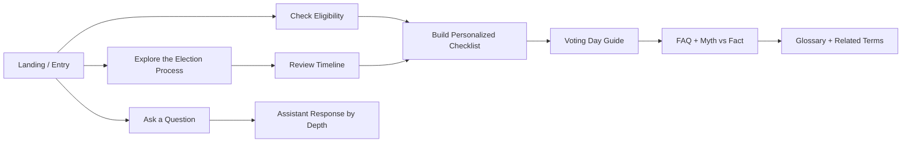
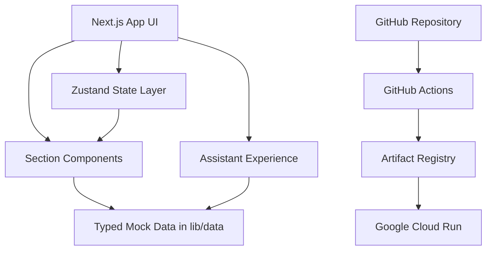

# Election Guide Assistant

<p align="center">
  
</p>

<p align="center">
  A production-grade civic education experience designed to make election information feel trustworthy, calm, and genuinely understandable.
</p>

<p align="center">
  <a href="https://election-guide-assistant-is2rul5cxa-el.a.run.app"><strong>Live on Cloud Run</strong></a>
</p>

## Overview

Election Guide Assistant is a premium civic-tech web application that helps first-time voters, students, and curious citizens understand how elections work without drowning them in institutional jargon.

Instead of behaving like a chatbot clone or a plain FAQ page, the product presents election education as a guided editorial experience: visual process explanations, a scrub-able timeline, scenario-based checklists, glossary definitions, myth-busting, and an assistant that can answer the same question at multiple depth levels.

The goal is simple: make election literacy feel clear, modern, and humane.

## Why this project matters

- **Civic information is often fragmented**
  - Official guidance is authoritative, but usually spread across different pages, formats, and terms.
- **First-time voters need confidence, not overload**
  - Many users do not need a legal document. They need a calm explanation of what to do next.
- **Design shapes trust**
  - The product avoids both generic AI SaaS styling and cold government-form aesthetics in favor of an editorial interface that feels serious, friendly, and credible.

## Product snapshot

- **Audience**
  - First-time voters
  - Students and educators
  - Citizens checking eligibility, timelines, documents, and polling-day steps

- **Core promise**
  - Explain elections in plain language with region-aware, modular content and progressive explanation depth.

- **Live deployment**
  - `https://election-guide-assistant-is2rul5cxa-el.a.run.app`

## Experience highlights

- **Guided entry experience**
  - An editorial hero with quick prompts, smart chips, and assistant-led exploration.

- **Visual election process mapping**
  - Clickable steps that explain how an election moves from registration to results.

- **Timeline explorer**
  - A phase-by-phase election timeline with detailed context, common mistakes, and citizen actions.

- **Personalized checklist**
  - Scenario-aware guidance for first-time voters, people who moved, students, and other voter contexts.

- **Voting day preparation**
  - Calm, actionable instructions for what to carry, what to verify, and what to do if something goes wrong.

- **Glossary and myth-busting**
  - Civic terms explained in plain language with related concepts and why each term matters.

- **Depth-aware assistant**
  - Answers available in `Quick`, `Beginner`, `Student`, and `Detailed` modes.

- **Accessibility controls**
  - Theme switching, reduced motion, large text, and high contrast support.

## Visual language

The interface is intentionally editorial:

- **Warm paper neutrals** for background surfaces
- **Deep ink charcoal** for typography and structure
- **Ember accent** for emphasis and focus states
- **Sage secondary tone** for taxonomy and calm supportive cues
- **Hairline borders and layered cards** instead of loud gradients or glassmorphism

This same visual system is reflected in the README graphics below.

## Project visual

<p align="center">
  
</p>

## User journey diagram



## Architecture diagram



## Feature breakdown

| Area | What it does | Why it matters |
| --- | --- | --- |
| Entry / Hero | Introduces the product, captures intent, and suggests useful prompts | Helps users start without guessing what to ask |
| Process Flow | Visualizes the election cycle as a sequence of understandable steps | Reduces confusion around how elections are structured |
| Eligibility Check | Offers a quick yes/no self-check | Gives users immediate confidence about basic requirements |
| Timeline Explorer | Explains pre-election, voting-day, and counting phases | Makes deadlines and milestones easier to understand |
| Personalized Checklist | Adapts action items to user scenarios | Converts information into concrete next steps |
| Voting Day Guide | Provides calm, practical polling-day instructions | Reduces anxiety and last-minute mistakes |
| FAQ + Myth vs Fact | Answers common questions and corrects misinformation | Reinforces trust through direct clarification |
| Glossary Explorer | Defines civic terms in plain language | Makes the rest of the experience easier to understand |
| Assistant Panel | Gives multi-depth answers with suggested follow-ups | Supports both quick answers and deeper learning |

## Design system

- **Display typography**
  - `Instrument Serif` creates a civic-editorial identity instead of a dashboard feel.

- **Interface typography**
  - `Inter` keeps controls, explanatory copy, and dense information readable.

- **Monospace utility**
  - `JetBrains Mono` is used for tabular figures, dates, and precise references.

- **Motion principles**
  - Framer Motion animations add rhythm and polish while respecting reduced-motion preferences.

- **Component system**
  - Custom buttons, chips, segmented controls, badges, accordions, sheets, and section headers were designed specifically for this product instead of relying on generic templates.

## Technology stack

- **Framework**
  - Next.js 14 with App Router

- **Language**
  - TypeScript

- **Styling**
  - Tailwind CSS with token-driven theming

- **Animation**
  - Framer Motion

- **State management**
  - Zustand with persisted user settings and checklist progress

- **Icons**
  - Lucide React

- **Hosting**
  - Google Cloud Run

- **CI/CD**
  - GitHub Actions with Artifact Registry deployment

## Repository structure

```text
app/
  globals.css
  layout.tsx
  page.tsx
components/
  sections/
  shell/
  ui/
docs/
  assets/
lib/
  data/
  store.ts
  types.ts
.github/
  workflows/
```

## Content architecture

All content lives in `lib/data/*.ts` and is strongly typed by `lib/types.ts`.

- `regions.ts`
  - Region metadata and supported election types
- `timeline.ts`
  - Election phases and phase-specific explanations
- `process.ts`
  - Visual explainer step content
- `scenarios.ts`
  - Voter scenarios used to personalize guidance
- `checklist.ts`
  - Checklist items tagged by scenario and need
- `votingDay.ts`
  - Polling-day preparation and issue handling
- `faq.ts`
  - Frequently asked questions and myth/fact entries
- `glossary.ts`
  - Civic terminology, plain explanations, and related concepts
- `assistant.ts`
  - Depth-aware assistant answers, intent matching, and glossary-aware query handling

The data model is structured so an official API or CMS layer can replace the mock content later without redesigning the experience.

## Accessibility

- **Semantic structure**
  - Uses landmarks such as `header`, `nav`, `main`, `aside`, and `footer`.

- **Keyboard support**
  - Command palette, sheets, sliders, and controls are keyboard reachable.

- **Visible focus states**
  - Ember focus rings are applied consistently across interactive elements.

- **Touch-friendly interaction**
  - Mobile targets meet minimum usable tap sizes.

- **Reduced motion**
  - Motion respects both OS preferences and the in-app setting.

- **High contrast and large text**
  - The interface supports stronger contrast and improved readability without breaking layout.

## Local development

```bash
npm install
npm run dev
```

Then open `http://localhost:3000`.

For a production check:

```bash
npm run build
npm start
```

## Deployment

The project is deployed to Cloud Run through GitHub Actions.

### Deployment flow

1. Push to `main`
2. GitHub Actions validates the app with `npm ci` and `npm run build`
3. Docker image is built and pushed to Artifact Registry
4. Cloud Run deploys the latest revision publicly

## Professional positioning

Election Guide Assistant is designed as a product-quality reference for how civic education tools can be both accessible and visually refined.

It demonstrates how structured public-interest information can be translated into a modern digital experience without sacrificing neutrality, clarity, or trustworthiness.

## Disclaimer

This guide is educational. Election laws, deadlines, eligibility rules, and procedures vary by region and change over time. For binding information, users should always verify details with the official election commission, electoral office, or equivalent public authority in their jurisdiction.
